# PacMan Game

## General Assembly Project One

This project was to recreate a classic arcade game, which was done in week 3 and 4 of the course. Out of the options presented, I chose to make a version of PacMan. The focus was on using JavaScript to ensure that the game was interactive and behaved in the way that you would expect given the original version of the game. 

### Deployment link

<https://hannahbodey.github.io/GA-Project-1-PacMan/> - Deployed project

<https://github.com/hannahbodey/Pac-Man-Project> - Git repo

### Timeframe & Working Team

This was an individual, independent project for which we were given a week. 

### Technologies Used

-HTML

-CSS

-JavaScript

-Excalidraw

### Brief

The brief was to create a version of the classic arcade game, PacMan. The player should eat all the food to clear the round, without being caught by the ghosts. The ghosts all chase the player, to varying degrees. If the player eats one of the special food icons, the ghosts change to being vulnerable to attack, and if caught by the player, the player gains points and sends the ghosts back to their starting position. The player should gain the highest score possible before being killed by the ghosts. 

For this version, the player had to be able to clear at least one board, and their score should be displayed at the end of the game. If these criteria were met, additional features should be added to the game; some suggestions included adding reset buttons, or highest scores using local storage. 

### Planning

Before beginning my project, I created two wireframes and some pseudocode. The first wireframe, pictured below, featured my initial thoughts on how to go about designing the game structurally. This formed the preliminary thinking before I began pseudocoding. 

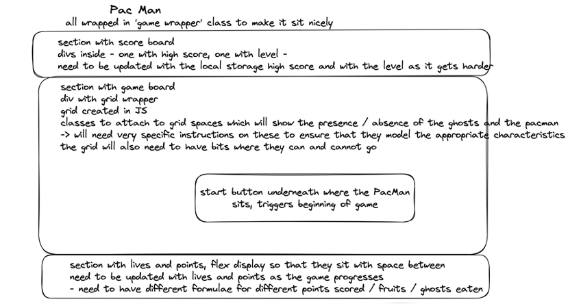

Once I had completed this wireframe, I completed a visual mock-up to guide me as I worked through styling the project and creating the HTML. 

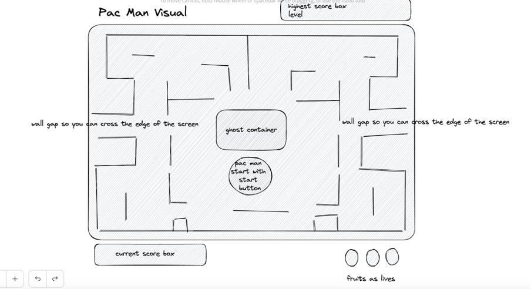

PacMan was created in 1980, and therefore I initially chose to try and give my version of the game a 1980s theme, including clips from Queen songs released in 1980. However, I realised that was going to be difficult to build consistently, and therefore I chose to change my theme to be ‘Sir Pacalot’, i.e. giving the game Mediaeval styling. 

Once I had made these initial plans, I began to pseudocode my JavaScript. I planned out the MVP in green, and added any additions that I might want to make once that was complete in light green. 

I planned out all the different elements and variables that I would need to interact with my HTML / CSS, and to ensure that the game was clearly structured. 

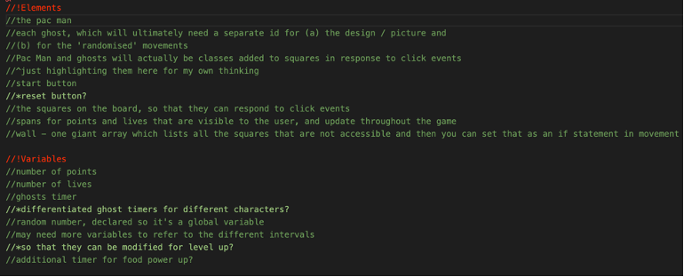

Once I had done this, I planned out the various functions required for the game. I was aiming to reduce as many of the individual actions required in the game to separate functions, in order to make the code as easy as possible to read, and therefore this stage of the planning process was quite important for me. 

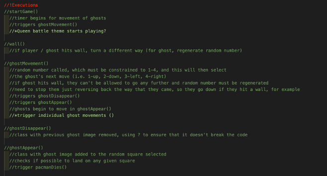

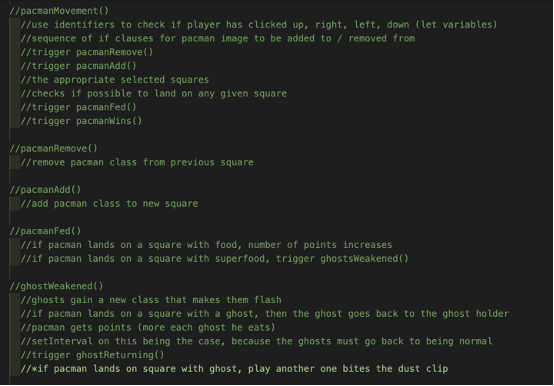

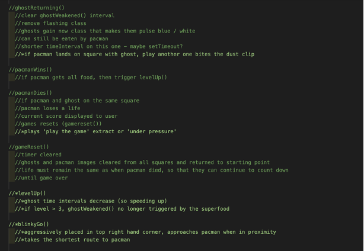

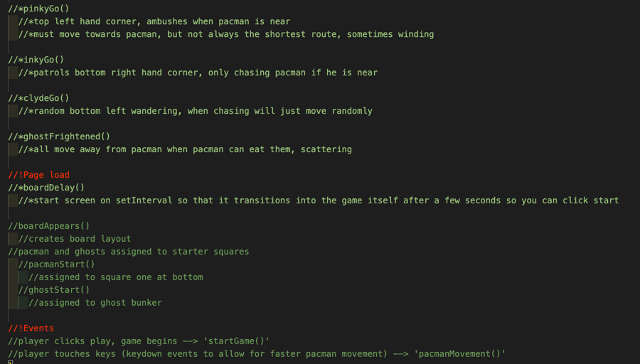

### Build / Code Process

Once I had completed my planning, I moved on to complete the HTML and CSS. Knowing, for example, that I would need to be able to very clearly directly target different elements on my page, I was careful to use specific IDs as well as classes for the different elements involved:

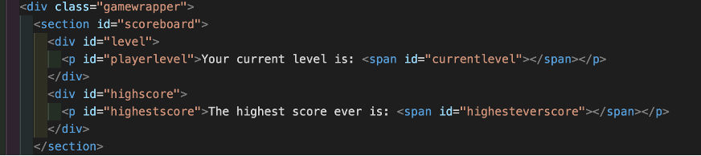

In the image above, I also separate out different divs that will sit above my game board into one section so that I can apply appropriate display characteristics and also amend the content of the spans (for example) via JavaScript. 

The idea of this project was to create as much of it as possible through JavaScript. Therefore, I quickly moved on to JavaScript in order to ensure that I didn’t miss any of the key logic required to make my game work. I began by ensuring that the board would set up appropriately, then moved on to PacMan’s movements. With this done, I set up random movements for one ghost, checked it was fully working, and then added three additional ghosts. Once these basics were complete, I began the real challenge of making the game much more difficult. This primarily meant creating categories for when the ghosts were chasing PacMan, and when they were scattering as they were no longer invincible. 

Initially, there therefore needed to be control and timing surrounding the player’s consumption of ‘special food’. I created a sequence of functions to facilitate this behaviour, which involved timers for the length of time before ghosts started flashing whilst they were vulnerable, and the speeds at which they should start moving (I had them all set at different speeds as per their characters, which I will discuss below). 

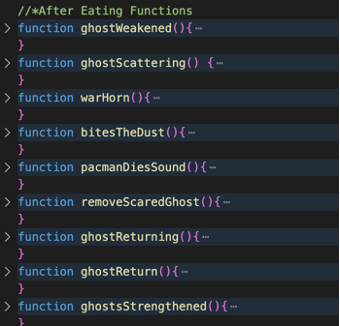

Here is the initial function used to weaken the ghosts (i.e. give them an additional class which changes their icon and also amends their behaviour):

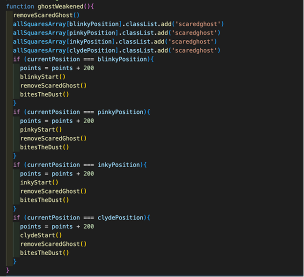

This in turn triggers multiple other functions, including sound effects. I was pleased with this because it is generally very tidy, and I think that the sequence is quite clear. However, I think it could be further improved if you could remove the repetition and have a more catch-all initial statement. I found it challenging to do this when trying to keep all the ghosts distinct and with their own character and icon. 

Once I had the ‘ghosts weakening’ effect working, I moved on to consider how to give each of the ghosts individual characters. Given that Blinky (usually red in the original PacMan) is the most vicious in the original version, I started with that character. He would need to be more responsive to the player’s movements and, therefore, I decided he would be most complicated to code. Blinky is supposed to predominantly patrol the top right hand corner of the screen, and take the quickest line of attack towards the player. I therefore, started by ensuring that Blinky’s initial movements were towards the top right hand corner. Once this was done, I added the blinkyChase() function, pictured below the blinkyGo() function.

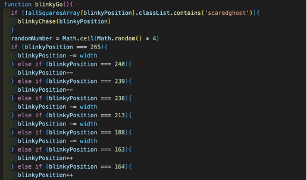

This function ensured that Blinky, already the fastest moving ghost, became significantly quicker when PacMan was nearby.  

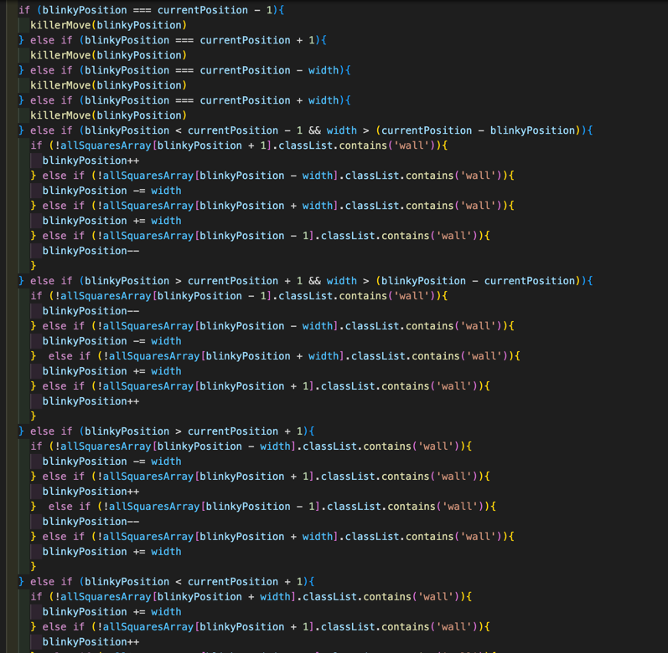

If Blinky was only one square away from the player in any direction, this triggered my killerMove() function, which ensured that the ghost always went onto the square that the player occupied if they were next to each other.

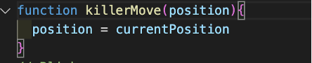

This worked for all ghosts, and therefore was highly reusable code, significantly reducing rewrites. 

Blinky then had an additional sequence of commands, which ensured that if the player was within a certain proximity, his movements were no longer randomised, but aimed to head in the direction of the player with the shortest possible route. I am sure that there is a much neater and more effective way to do this, however, I challenged myself to get Blinky to display some of this behaviour without taking code from searches that I did not understand. Instead, I tried to think about the logic of Blinky’s movements, and where he would need to go, if, for example, the player was on the row below him but there was a wall in the way. I also gave Pinky, the second most deadly ghost, a clearer set of movements than the remaining two ghosts, such that he too would attack when the player was close. His attack is supposed to be more roundabout, so I left fewer commands for his movement, in order to allow more of it to be dictated by the random number generator. 

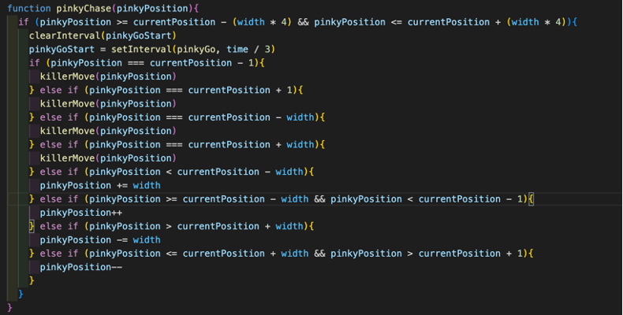

### Challenges

The way in which I created the board was quite laborious, and ultimately took up lots of lines of code. I used modulus calculations to try and count as many of the squares that would require / not require a wall as possible from the outset, but this still left me having to hardcode multiple squares into having / not having a wall. 

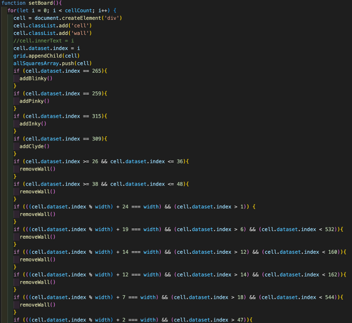

I really wanted to avoid hardcoding these wall numbers into the code, as I initially considered changing the board layout on a level up, but this was the best solution that I could find. In the future, it might be easier to simply hardcode out an array of squares to feature walls / no walls, and then push() certain numbers into that array if I wanted to amend the layout of the board. When I initially started though, I wanted to try and find a way to do this without simply writing a very long array, and this was my best attempt. 

Additionally, although I did manage to dictate some of Blinky’s movements, I did find that his movements became quite jerky and sometimes he went the opposite way to what I expected. This meant that his attack was less deadly than it should have been, and certainly less slick. In future, I would want to employ a more sophisticated pathfinder methodology; on this occasion, I wanted to practise that which I’d learned on the course up to that point, applying it to new and more complex problems.  

### Wins

I was very pleased with the ghost behaviour that I managed to code featured in a previous section, including their response to the player eating ‘special food’. I also was pleased with the consistency of my theme, and the level of intricacy in each of the characters’ chosen icons. 

Additionally, I was pleased with the mutability of the buttons in my game, as they were more user friendly because of where I had them appearing / disappearing / being disabled at various points. 

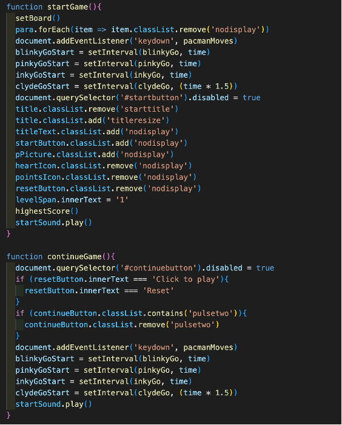

This featured differences between the start of the game and when the game would continue after the player had lost one or two lives. The addition of pulsing on the continue button was for player ease, so that they would definitely click that button to restart the ghosts at the beginning of another round. I was pleased that I had managed to make the keydown features inactive until the game actually began. 

### Key Learnings and Takeaways

One of the biggest takeaways for me from this project was the importance of clear pseudocode. I had begun to use this more in the week leading up to this project, but only fully implemented it when starting work on this project. Having clearly thought through each function in my JavaScript and how each one would contribute to my creation of a viable final product considerably improved the clarity of my thought processes as well as of my code. This also meant that I completed my MVP much more quickly in the week than I had anticipated, which allowed me to spend more time refining the different additional features that I wanted to give the project. 

Although this may sound general, I think this project also significantly enhanced my ability to think through any problems encountered and rectify them myself. Given that this was my first project, until this point I had only really been working on homeworks for the course, and had not been given free reign or as long to think about each element of the code that I was writing, and the impact that it might have on the output. 

### Bugs

Occasionally, if the player presses the down arrow before the right arrow, then there is an error message in the console. 

It is also possible for the player to move around the grid after resetting and without pressing play, which means that they can cheat onto the next level. Although I managed to disable the keydown events at the start of the game, I didn’t manage to disable them at this point in the game without disrupting the smooth running of the game.

Despite my having set width requirements, sometimes the grid does not show correctly on certain screens, and the browser window has to be made smaller. 

## Future Improvements

In the future, I would like to improve my ability to refactor my code, as mentioned above. I would also like to enhance the ghost movements so that they were slicker. I think it would be better if Blinky, for example, could more intelligently find the shortest route to the player, and if Pinky could always find a short route with some unexpected turns in order to ambush the player. This, however, would require quite a lot more understanding of how to interact with the grid of the board and would require significant caveats to ensure that the ghosts were not then able to jump walls. 

I also think it would be excellent to add little video scenes between each level or loss of life to keep the player engaged.
